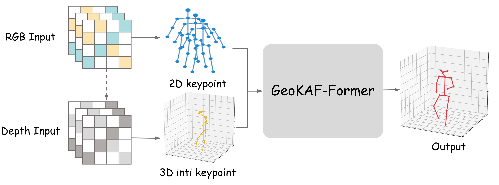
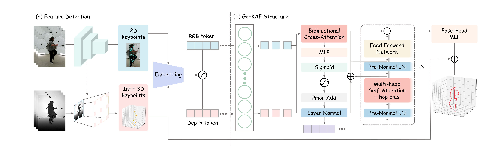
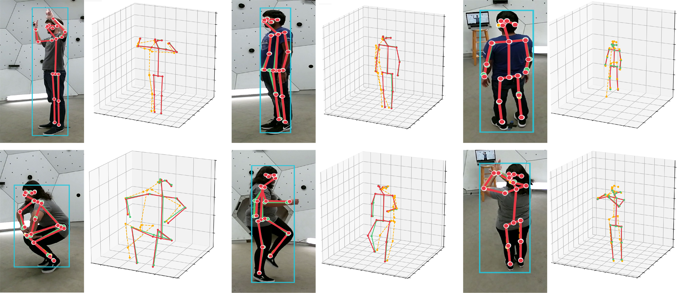
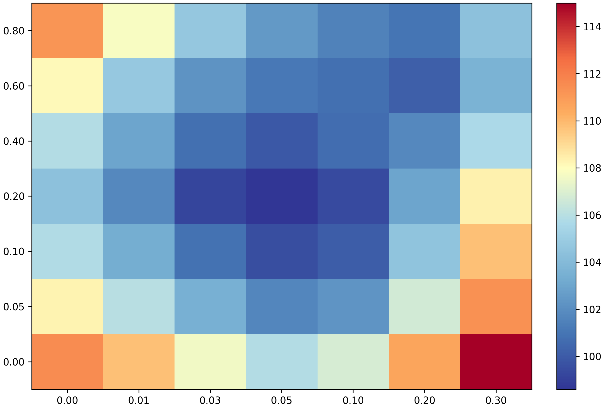

# GeoKAF-Former

**GeoKAF-Former: A Geometry-Aware Skeleton Correction Network for RGB-D 3D Human Pose Estimation**

GeoKAF-Former is an RGB-D 3D human pose estimation framework that combines human structure feature extraction, RGB-D geometry-aware lifting, and skeleton-topology-guided residual correction. The method first obtains 2D human structure cues from RGB images, uses depth maps and camera calibration to generate a metric-scale initial 3D skeleton, and then refines the skeleton with keypoint-level local RGB-D tokens and topology-aware attention.

> The code is currently being organized and will be released soon.

## Overview

Instead of densely fusing the whole RGB-D image, point cloud, or voxel space, GeoKAF-Former focuses on local evidence around human joints. This design reduces redundant background information and makes the backend concentrate on joint-level RGB-D geometry and skeleton consistency.

## Method

The framework contains three main parts:

- **Human structure feature extraction**: predicts 2D keypoints and confidence scores from RGB images.
- **RGB-D geometry-aware lifting**: uses camera calibration and robust local depth estimation to obtain an initial 3D skeleton.
- **GeoKAF-Former correction**: refines the initial skeleton with local RGB-D tokens, reliability-aware gating, bidirectional cross-feature attention, and skeleton hop-distance bias.

## Results

GeoKAF-Former is evaluated on **MVOR** and **CMU Panoptic RGB-D**. The model achieves competitive accuracy, skeleton completeness, and backend evaluation speed with a compact correction network.

| Dataset | MPJPE ↓ | PCP ↑ | PCK@100 / 500 ↑ | F1 ↑ | Backend FPS ↑ |
|---|---:|---:|---:|---:|---:|
| MVOR | **98.6 mm** | **75.3** | **64.8 / 98.4** | **86.3** | **39.1** |
| CMU Panoptic RGB-D | **17.1 mm** | **99.7** | **98.5 / 99.9** | **99.5** | **22.5** |

### Qualitative Results

Red skeletons indicate corrected predictions, green skeletons denote ground truth, and yellow dashed skeletons denote geometric initial poses.

### Ablation

The ablation results show that local RGB-D tokens, reliability modeling, bone-length consistency, and skeleton-topology guidance contribute to more stable 3D pose correction.

## Status

This repository is being prepared for public release. The following materials will be released soon:

- training and evaluation code;
- dataset preparation scripts;
- model configuration files;
- pretrained checkpoints where available;
- instructions for reproducing the reported results.

## Citation

The paper is currently under preparation. Citation information will be updated after publication.
